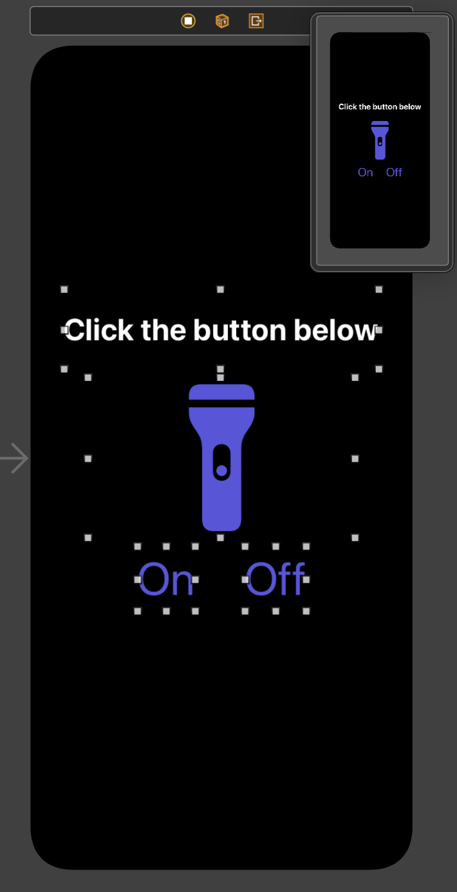

# Swift - Flash App 
* 스파르타코딩클럽 - iOS 앱개발 기초반을 수강하면서 배우는 Swift

## [1주차](https://www.notion.so/iOS-1-8853f9fd744f4334b636944012718273#f28db804624f4af6aa46ec2e3e46610f)
## 1. Xcode 설치 및 사용법 익히기
* [Xcode 설치](https://apps.apple.com/us/app/xcode/id497799835?mt=12)
  * 설치 후에는 꼭 Xcode를 "실행"시켜서 "컴포넌트 설치"까지 완료해야 한다. 
* Xcode에서 프로젝트 만들기
  1. Create a new Xcode project 클릭
    
  2. iOS - App 선택하고 Next 버튼 누르기
    
  3. Product Name에 FlashApp 입력하고 Organization Identifier 을 자신에게 맞게 변경
    

    * **중요** 특히 3번은 그림과 같게 설정하기!
      : Interface는 Storyboard / Life Cycle은 UIkit App Delegate / Language는 Swift ! 
    * 그림과 같은지 확인했으면 Next 누르기!

## 2. 시스템 아이콘
* 애플은 iOS 개발자들을 위해서 자주 쓰이는 아이콘들을 제공한다. 무려 2400개가 넘는 아이콘들이 들어있다!
  * 수많은 시스템 아이콘의 종류를 보려면 [https://developer.apple.com/sf-symbols/](https://developer.apple.com/sf-symbols/) 에 들어가서 SF Symbols 2.1 이라는 맥 앱을 설치해서 확인해 볼 수 있다!<br>
  <br>
* 시스템 아이콘은 기본적으로 형태만 제공하고 색깔은 개발자가 원하는 색깔로 넣을 수 있다. 오른쪽 제어 탭에서 Tint Color를 바꾸면 색깔을 바꿀 수 있다.
  * [https://www.uicolor.io](https://www.uicolor.io/) 에서 손쉽게 코드를 얻을 수도 있다.

## 3. 해상도와 이미지 에셋
* 이미지 에셋은 iOS 프로젝트에서 이미지를 모아서 관리하는 폴더라고 볼 수 있다.
  * 배수에 따라 해상도는 다르지만, 결국 같은 이미지들을 프로젝트에 여러개 추가하면 파일들이 쌓이면서 관리하기 어려워질 것이다. 이런 혼란을 막기 위해 이미지 에셋에서는 각 이미지마다 서로 다른 해상도를 묶어놓는 기능을 제공한다. 
* 그럼 이미지를 각각 사이즈에 따라 편집해야 되는데 귀찮을 것이다...
  * [https://appicon.co](https://appicon.co) 에서 자동으로 편하게 이미지를 편집해준다!
  
  
## 4. Swift 기초 문법
* 함수 기본 생김새
```Swift
// 만들기
func 함수이름(필요한 변수들과 그 타입들) -> 반환할 변수타입 {
	내릴 명령어들을 순차적으로 작성
  return 결과값
}
// 사용하기
결과값 = 함수이름(필요한 변수들)

// 반환할 변수타입이 없으면 '->' 부분을 생략!
func 함수이름(필요한 변수들과 그 타입들) {
	내릴 명령어들을 순차적으로 작성
}
//사용하기
함수이름(필요한 변수들)
```

* sum 함수
```Swift
// 두 숫자를 입력받으면 더한 결과를 돌려주는(return) 함수
func sum(num1: Int, num2: Int) -> Int {
    print("num1: ", num1, ", num2: ", num2)
    return num1 + num2
}

var sumResult = sum(num1: 3, num2: 5) 
print(sumResult) // 8

sumResult = sum(num1: 4, num2: -1)
print(sumResult) // 3
```

* 나이 계산 함수
```Swift
// 두 숫자를 입력받으면 더한 결과를 돌려주는(return) 함수
func sum(num1: Int, num2: Int) -> Int {
    print("num1: ", num1, ", num2: ", num2)
    return num1 + num2
}

var sumResult = sum(num1: 3, num2: 5) 
print(sumResult) // 8

sumResult = sum(num1: 4, num2: -1)
print(sumResult) // 3
```
## 5. 스크린 손전등 앱 만들기
* 스토리보드
  * {: width="50%" height="50%"}
* 코드
```Swift
//
//  ViewController.swift
//  Flash App
//
//  Created by oneonlee on 2021/06/13.
//

import UIKit

class ViewController: UIViewController {

    @IBOutlet weak var imageView: UIImageView!
    @IBOutlet weak var label: UILabel!
    override func viewDidLoad() {
        super.viewDidLoad()
        // Do any additional setup after loading the view.
    }

    
    @IBAction func onButtonDidClick(_ sender: Any) {
        view.backgroundColor = UIColor.white
        label.textColor = UIColor.black
        imageView.image = UIImage(systemName: "flashlight.on.fill")
    }
    
    @IBAction func offButtonClick(_ sender: Any) {
        view.backgroundColor = UIColor.black
        label.textColor = UIColor.white
        imageView.image = UIImage(systemName: "flashlight.off.fill")
    }
}
```
  
  
